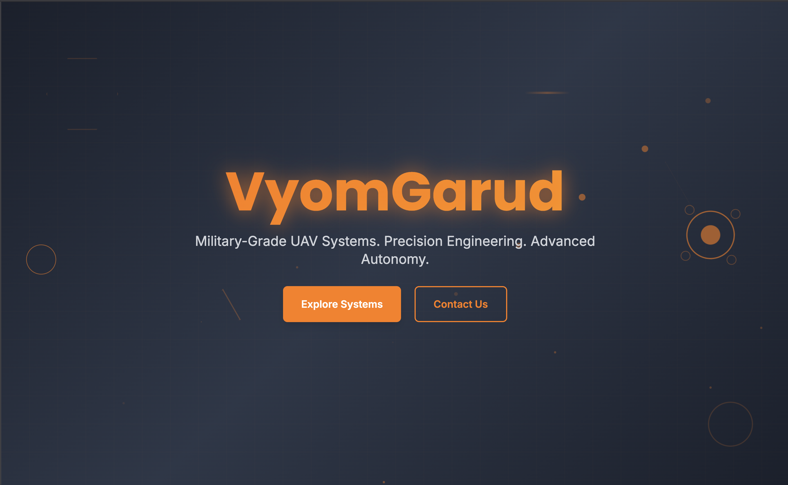
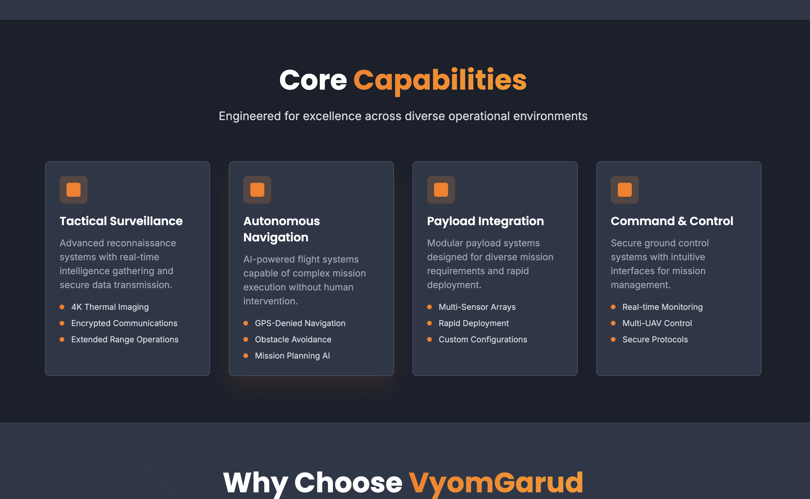
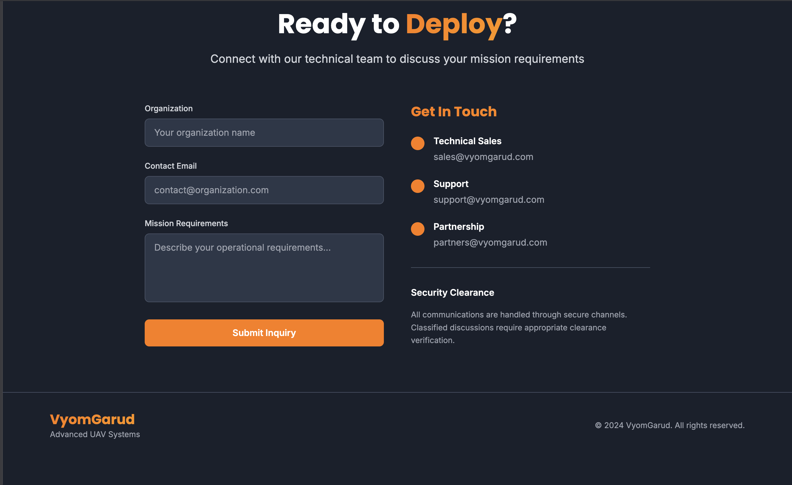
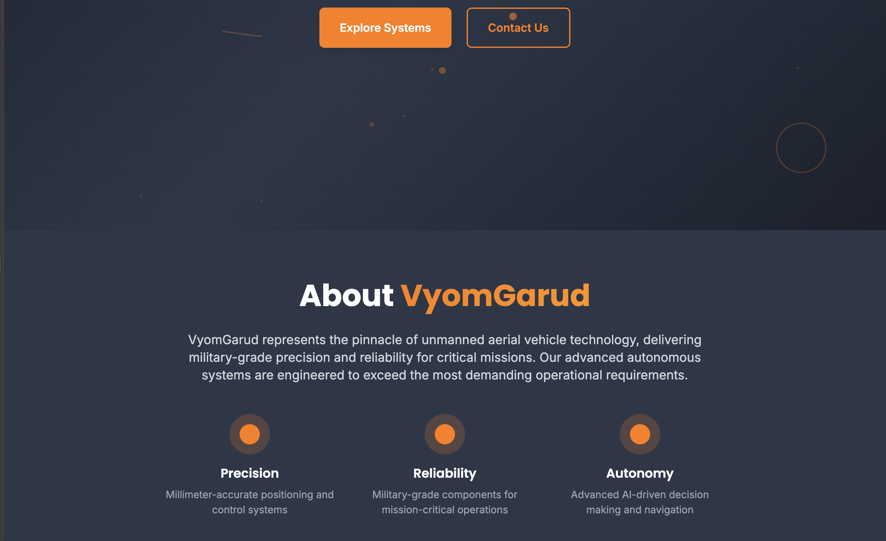

# VyomGarud Landing Page

A modern, military-grade landing page for VyomGarud UAV systems built with Next.js, React, and Tailwind CSS.

## Features

- **Modern Design**: Dark, military-inspired aesthetic with orange accents
- **Responsive**: Fully responsive across all device sizes
- **Animations**: Smooth animations using Framer Motion
- **Performance**: Built with Next.js for optimal performance
- **Typography**: Professional fonts (Poppins, Inter, Montserrat)

## Tech Stack

- Next.js 14
- React 18
- TypeScript
- Tailwind CSS
- Framer Motion

## Getting Started

1. Install dependencies:
```bash
npm install
```

2. Run the development server:
```bash
npm run dev
```

3. Open [http://localhost:3000](http://localhost:3000) in your browser

## Project Structure

```
├── app/
│   ├── components/
│   │   ├── Hero.tsx          # Hero section with company name and CTA
│   │   ├── About.tsx         # Company mission and values
│   │   ├── Capabilities.tsx  # Product/service cards
│   │   ├── Highlights.tsx    # Key feature bullets
│   │   └── Contact.tsx       # Contact form and footer
│   ├── globals.css           # Global styles and fonts
│   ├── layout.tsx            # Root layout
│   └── page.tsx              # Main page component
├── tailwind.config.js        # Tailwind configuration
└── package.json
```

## Design System

### Colors
- Primary: `#ff7b00` (Orange)
- Charcoal Dark: `#1a202c`
- Charcoal: `#2d3748`
- Charcoal Light: `#4a5568`

### Fonts
- Headings: Poppins
- Body: Inter
- Alternative: Montserrat

## Build & Deploy

```bash
npm run build
npm start
```




